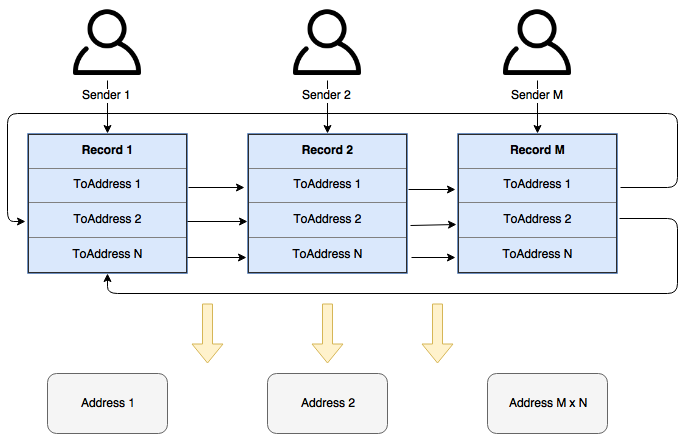

# Coin Mixer Challenge

## Objective

Create a Jobcoin mixer, given the Jobocoin API provided [https://jobcoin.gemini.com/hazy/api](here). You may collect a fee for your mixing service if you wish. We recommend doing the coding challenge in one of these languages: Scala, Java 8, JavaScript, Python (2 or 3), or C++.  

## Solution

This Jobcoin mixer has been written in JavaScript and it runs on Node.js. It uses a _round robin_ approach to obfuscate it's outputs. See below for extended explanation of algorithm.

## Installation and testing

See live working version of this project at [http://heroku.com](Heroku)

### Installation

To install, make sure you have Node.js version 9.4.0, then run:

```
npm install
```

### Testing

To run all tests, type:

```
./node_modules/.bin/mocha tests/
```

## How to use it

1. Navigate to the main page
2. Enter your Jobcoin from-address and up to three to-addresses
3. Click the Send button
4. Navigate to [https://jobcoin.gemini.com/hazy](https://jobcoin.gemini.com/hazy) and send coins from _from-address_ to address _Mixer_
5. The Mixer will notice the transfer and begin the mixing process


Note that the limitation of three addresses is only in the HTML UI. If you used `curl` to make a POST request to the server, you'd be able to send as many to-addresses as you wished. For example, you can try this:

```
curl -H "Content-type: application/json" -d '{"fromAddress": "Charlie", "toAddress":["Charlie01","Charlie02","Charlie03","Charlie04","Charlie05"]}' localhost:3000/new
```

## Algorithm

Once a mixing request is made (via the UI, or curl), it is recorded in the mixer as the following structure:

```Javascript
record = {
    fromAddress: String,
    toAddress: Array[String],
    timestamp: Date,
    amount: Number = null
}
```

A new process is spawned to periodically poll the Jobcoin network and look for a transaction that matches the above record.

Once the transaction is found, the record is updated with the `amount` and `timestamp` found in the Jobcoin transaction.

At this point the record is included in rotation with the rest of the records (assuming there are more).

The mixer sends part of the coins to the first record's first recepient address, then the second record's first recepient address, etc. When all records are iterated, the mixer begins sending to the second recepent address, etcj

The iteration of recepient addreses happens at a random time interval.



## Issues

* The mixer works best when servicing multiple users at the same time. A single user may be guessed easliy.
* Each user should provide as many to-addresses as possible. A single to-address may be guessed easily.
